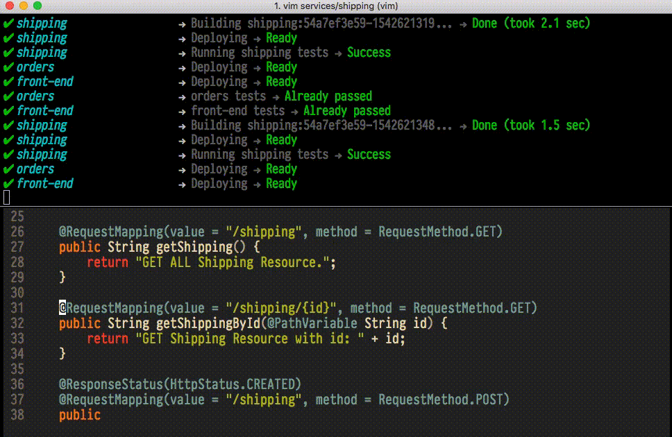

[](https://circleci.com/gh/garden-io/garden/tree/master)

<p align="center">
  
</p>

Garden is an open-source development engine for Kubernetes, containers and serverless backends, designed to make it easy to test and develop multi-service systems.

- **Focus on what matters:** Garden continuously builds, tests and deploys your changes into your own persistent development environment as you code. Easily define and continuously run tests in the background, and focus on writing code.

- **Codify your workflow:** Make your workflow reproducible and portable. Define your stack using simple, intuitive declarations and get your environment up and running with a single command, without changing any code.



The project is in _alpha stage_. APIs may change, and platform stability and support is still limited. To understand the motivation behind Garden, [click here](https://garden.io/#motivation).

## Quick start

Head over to the [Basics](https://docs.garden.io/basics) section in our documentation for details
on how to set up and use Garden, or look through our [Simple Project](https://docs.garden.io/examples/simple-project)
guide to get a quick sense of how it works.


## Documentation

You can find the Garden documentation at [https://docs.garden.io](https://docs.garden.io/).

Overview:
- [Basics](https://docs.garden.io/basics), for installation instructions, our quick start guide, and an overview of the main  concepts around Garden.
- [Using Garden](https://docs.garden.io/using-garden), for features and usage, Garden configuration files, usage with remote clusters, and setting up hot reload.
- [Example Projects](https://docs.garden.io/examples) contains guides based on some of the [examples](https://github.com/garden-io/garden/tree/master/examples).
- [Reference](https://docs.garden.io/reference), for the glossary, commands reference, configuration files reference, and template strings reference.
- [FAQs](https://docs.garden.io/faqs).

## Features

- Garden keeps track of all interdependencies between your services.
- It can automatically re-build, re-deploy, and re-test your services as you code.
- Due to Garden's dependency graph, you get really fast feedback loops: It makes sure only what's needed gets re-built, re-deployed, and/or re-tested.
- Hot reload lets you near-instantaneously update code and static files in containers as they run, on services that support in-place reloading.
- Remote sources support allows your project to pull code from various different repositories.
- Your services can be anything that runs in a Docker container—or OpenFaaS functions.
- And an extensible plug-in system ensures you can add anything that's not on this list :)

## Examples

There are many examples of how to use Garden in a myriad of different ways on the [examples](https://github.com/garden-io/garden/tree/master/examples) folder of our repository.

For written guides based on some of these examples, check out the [examples section](https://docs.garden.io/examples) of our documentation.

For a simple example of how Garden configuration files look, see below:

```yaml
module:
  name: go-service
  description: Go service container
  type: container
  services:
    - name: go-service
      ports:
        - name: http
          containerPort: 80
      ingresses:
        - path: /hello-go
          port: http
```

## Support

Please join the Garden [Slack workspace](http://chat.garden.io) to ask questions, discuss how Garden might fit into your workflow, or even just chat about all things DevOps.

## License

Garden is licensed according to [Mozilla Public License 2.0 (MPL-2.0)](LICENSE.md).
